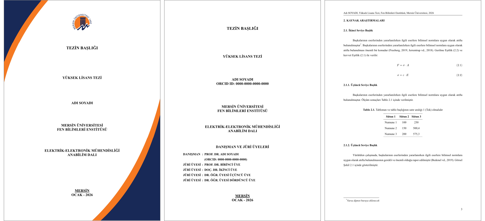

# community-meu-gsnas-thesis

🇬🇧 **English** | [🇹🇷 Türkçe](README.tr.md)

[](https://github.com/hkngln/community-meu-gsnas-thesis/actions/workflows/ci.yml)
[](https://github.com/hkngln/community-meu-gsnas-thesis/releases/latest)

A [Typst](https://typst.app) template for master's and doctoral theses at the Graduate School of Natural and Applied Sciences (Fen Bilimleri Enstitüsü), Mersin University.

The template is based on the institute's official documents:
- Thesis writing template `Ornek_Tez_Yazim_Sablonu_20250911.docx`
- Outer front cover (EK-5) and back cover (EK-6)
- LaTeX template v1.4



> **Note:** This is not an official product of the institute. The logo and images belong to Mersin University (see [License](#license)). Check the current [thesis writing guidelines](https://www.mersin.edu.tr) before submitting your thesis. If a rule does not match, please [open an issue](https://github.com/hkngln/community-meu-gsnas-thesis/issues).

The thesis itself is printed in **Turkish**, as the institute requires: headings (ÖZET, ONAY, KAYNAKLAR…), labels (Tablo, Şekil, Tanım…) and cover texts. The template's code uses **English** names.

## Features

- Outer front cover, title page, approval, ethics statement, Turkish and English abstracts, acknowledgements, table of contents, lists of tables and figures, abbreviations, references, appendices, CV and back cover.
- Measurements identical to the Word template:
  - A4 paper, 2.5 cm margins, Times New Roman 11 pt (falls back to Libertinus Serif if Times New Roman is not installed).
  - Line spacing matches Word's 1.5 exactly; front matter, tables and figures are single-spaced.
  - 1.25 cm first-line indent.
- Chapters, references, appendices and the CV start on a new odd-numbered page. Blank filler pages carry no header or page number.
- Figures, tables and equations are numbered by chapter (**Tablo 2.1.**, **Şekil 2.1.**, (2.1)); in appendices "E.1". A table that does not fit on a page continues on the next one with its header row and "**Tablo 2.1** (devamı)" (continued).
- The institute's citation style (based on APA 7, following the thesis directive, articles 11 and 16): "vd." and "ve" in Turkish theses, "et al." and "&" in English ones; see [Citations and references](#citations-and-references). Footnotes use \*, †, ‡ and restart on every page.
- Every field you have not filled in shows up **in red** in the PDF.

## Installation

### 1. Install Typst

[Typst](https://typst.app) is a typesetting system similar to LaTeX, but much faster and easier to learn. This template requires **Typst 0.15 or later**.

| System | Command |
|---|---|
| macOS ([Homebrew](https://formulae.brew.sh/formula/typst)) | `brew install typst` |
| Windows | `winget install --id Typst.Typst` |
| Linux / other | Download from [GitHub releases](https://github.com/typst/typst/releases/latest) or `cargo install --locked typst-cli` |

Check the installation:

```sh
typst --version   # typst 0.15.x
```

New to Typst? The [official tutorial](https://typst.app/docs/tutorial) and [documentation](https://typst.app/docs) are a good start.

> **About the web app:** the [typst.app](https://typst.app) web editor cannot see packages installed on your computer. For now, this template is used with Typst installed locally.

### 2. Install an editor and extension (recommended)

Typst files are plain text and can be written in any editor. For a comfortable setup, use an editor with the [Tinymist](https://github.com/Myriad-Dreamin/tinymist) extension: it gives a live PDF preview, autocompletion and inline errors.

**Recommended: [Visual Studio Code](https://code.visualstudio.com/download) + [Tinymist](https://marketplace.visualstudio.com/items?itemName=myriad-dreamin.tinymist)**
- Free; runs on Windows, macOS and Linux.
- The easiest setup if you are new to Typst.
- Install VS Code, then search for "Tinymist" in the Extensions panel (`Ctrl/Cmd+Shift+X`) and install it.

Other options:

| Editor | Typst support |
|---|---|
| [VSCodium](https://vscodium.com), Cursor and other VS Code forks | Tinymist via [Open VSX](https://open-vsx.org/extension/myriad-dreamin/tinymist) |
| [Zed](https://zed.dev) | [Typst extension](https://zed.dev/extensions/typst) |
| Neovim, Helix, Emacs and others | [Tinymist installation docs](https://myriad-dreamin.github.io/tinymist/) |

### 3. Font: Times New Roman

The guidelines require **Times New Roman**. It is included with Windows and macOS; on Linux, install the `ttf-mscorefonts-installer` package. "Times New Roman" should appear in the output of `typst fonts`.

**Fallback:** if Times New Roman is not installed, the template uses [Libertinus Serif](https://github.com/alerque/libertinus), which ships with Typst, so the thesis still compiles. Typst then shows this warning, which is expected:

```
warning: unknown font family: times new roman
```

Line spacing and margins stay the same with the fallback font, but letter widths differ, so line breaks and the page count may change. **Install Times New Roman before submitting your thesis.**

**Alternative:** [TeX Gyre Termes](https://www.gust.org.pl/projects/e-foundry/tex-gyre/termes) is a free Times clone. It is not in the default list because Typst warns about every font in the list that is not installed. If you install it, add it with the `font` setting:

| System | Install TeX Gyre Termes |
|---|---|
| macOS | `brew install --cask font-tex-gyre-termes` ([Homebrew](https://formulae.brew.sh/cask/font-tex-gyre-termes)) |
| Debian / Ubuntu | `sudo apt install fonts-texgyre` ([package](https://packages.debian.org/stable/fonts-texgyre)) |
| Windows / other | Download from [GUST](https://www.gust.org.pl/projects/e-foundry/tex-gyre/termes) |

```typ
#show: thesis.with(
  font: ("Times New Roman", "TeX Gyre Termes", "Libertinus Serif"),
  // ...
)
```

The first font in the list that is installed is used.

### 4. Install the template

Clone the package into Typst's local package directory. The directory name must match the version number.

```sh
# macOS
git clone --branch v0.5.1 https://github.com/hkngln/community-meu-gsnas-thesis \
  "$HOME/Library/Application Support/typst/packages/local/community-meu-gsnas-thesis/0.5.1"

# Linux
git clone --branch v0.5.1 https://github.com/hkngln/community-meu-gsnas-thesis \
  "$HOME/.local/share/typst/packages/local/community-meu-gsnas-thesis/0.5.1"
```

```powershell
# Windows (PowerShell)
git clone --branch v0.5.1 https://github.com/hkngln/community-meu-gsnas-thesis `
  "$env:APPDATA\typst\packages\local\community-meu-gsnas-thesis\0.5.1"
```

The latest version number is on the [Releases](https://github.com/hkngln/community-meu-gsnas-thesis/releases) page.

## Starting a new thesis

```sh
typst init @local/community-meu-gsnas-thesis:0.5.1 my-thesis
cd my-thesis
typst watch main.typ
```

In VS Code, open the `my-thesis` folder, open `main.typ` and run **Typst Preview: Preview Opened File** from the command palette (`Ctrl/Cmd+Shift+P`). The PDF preview updates as you type.

Fill in your details in `main.typ` and write your chapters in the files under `chapters/`.

| File | Contents |
|---|---|
| `main.typ` | Thesis settings, chapter includes, references, appendices, CV |
| `front/abstract-tr.typ`, `front/abstract-en.typ`, `front/acknowledgements.typ` | Turkish abstract, English abstract, acknowledgements |
| `chapters/*.typ` | One file per chapter; each `= HEADING` starts on a new odd-numbered page |
| `references.bib` | BibTeX references; `@key` in the text → (Author vd., 2019) |
| `figures/` | Images |

## User guide

All settings and functions, with their Turkish equivalents and examples, are in the **[user guide](docs/user-guide.md)** ([Türkçe kullanım kılavuzu](docs/kullanim-kilavuzu.md)).

The most common ones:

| Setting / function | Turkish equivalent |
|---|---|
| `title`, `student`, `advisor`, `jury` | Tez başlığı, öğrenci, danışman, jüri |
| `degree: "master"` / `"phd"` | Yüksek Lisans / Doktora |
| `decision: "unanimous"` / `"majority"` | oybirliği / oyçokluğu |
| `abstract-tr`, `abstract-en`, `acknowledgements` | Özet, Abstract, Teşekkür |
| `two-sided` | Çift taraflı baskı (chapters start on a right-hand page) |
| `front-cover`, `back-cover` | Dış ön kapak (EK-5), arka kapak (EK-6) |
| `#references`, `#appendices`, `#cv` | Kaynaklar, Ekler, Özgeçmiş |
| `#definition`, `#theorem`, `#proof`, `#note`… | Tanım, Teorem, Kanıt, Not… |

## Writing cheat sheet

| What | How |
|---|---|
| Chapters and sections | `=`, `==`, `===`, `====` → 1., 2.1., 2.1.1., 2.1.1.1. |
| Table (caption on top) | `#figure(table(..), caption: [..]) <tbl-x>` → **Tablo 2.1.** |
| Figure | `#figure(image("../figures/a.png"), caption: [..]) <fig-x>` → **Şekil 2.1.** |
| Numbered equation | `$ F = sigma dot A $ <eq-x>` → (2.1); `@eq-x` → Eşitlik (2.1) |
| Citation | `@grady2019` → (Grady vd., 2019); `#cite(<grady2019>, form: "prose")` → Grady vd. (2019) |
| Secondary source | `#secondary-cite(<ozturk2012>, year: 2012)[Singh, 2007]` → (Singh, 2007: Öztürk vd. 2012’den) |
| Footnote | `#footnote[..]` → \*, †, ‡ |

If you have no appendices, delete the `#appendices[..]` line. Inside `#appendices`, write appendix sections as `== EK-1: Title`; they are not numbered, and figures, tables, equations and theorems there are numbered E.1, E.2… Lists of tables and figures are omitted when there are no tables or figures.

> **Using v0.1.x?** In v0.2.0 the package was renamed from `meu-fbe-tez` to `community-meu-gsnas-thesis` and all names became English; the renaming itself did not change the PDF output. See the [migration table](docs/user-guide.md#migrating-from-v01x) in the user guide.

## Citations and references

The template uses the institute's citation style. It is based on APA 7 and follows articles 11 and 16 of the Graduate School of Natural and Applied Sciences thesis directive (Tez Yazım Yönergesi, Senate 04.04.2024, 2024/37) and the examples in the Word template. Where the directive differs from APA, the directive wins.

- Set the thesis language at the start with `language`: `"tr"` (default) or `"en"`. Two-author in-text citations then use "ve" (`(Engin ve Özçimen, 2016)`) or "&" (`(Engin & Özçimen, 2016)`). The reference list uses "&" in both, as in the institute's template. Printed headings and labels stay Turkish.
- Several citations together are sorted by date, each keeps its author, and they are separated by semicolons (article 16/2): `@aydeniz2015 @couch2016` → (Aydeniz vd., 2015; Couch ve Metz, 2016).
- A source cited through another work (article 16/3): `#secondary-cite(<ozturk2012>, year: 2012)[Singh, 2007]` → (Singh, 2007: Öztürk vd. 2012’den). Only the work you read (`ozturk2012`) goes into the reference list; the original is not added to the .bib file. The Turkish suffix ('den, 'dan, 'ten, 'tan) is chosen from the year; for an undated source write `year: "t.y."`. Give `year` exactly as the work's year in the reference list (e.g. `"2012a"`). English theses use the APA form: (Singh, 2007, as cited in Öztürk et al., 2012).
- The bibliography has a 1.25 cm hanging indent and a blank line between entries.
- Do not pass `style:` to `bibliography(...)`: the template supplies the style. If an old `main.typ` still has `style: "apa"`, compilation stops with an error that says so; delete that part.
- In a Turkish thesis `@phdthesis` prints "[Doktora tezi]. University." and `@mastersthesis` "[Yüksek lisans tezi]. University."; a thesis with a `url` or `doi` (published) prints "[Doktora tezi, University]. Database." `@techreport` prints "(Rapor No. …). Institution." For any other type name, add a `type` field to the BibTeX entry, e.g. `type = {Yayımlanmamış doktora tezi}` → "[Yayımlanmamış doktora tezi]".
- A `@book` in a series (`series` with `number` or `volume`) prints the series with the title, as a chapter does: "Advances in pharmaceutical sciences: No. 7. Nanotechnology based approaches…" (`volume` → "C. 7" / "Vol. 7"). A standard is a `@standard` entry with `organization`, `type` and `number`: `organization = {International Organization for Standardization}, type = {ISO Standard}, number = {45001:2018}` → "International Organization for Standardization. (2018). Title (ISO Standard No. 45001:2018). URL"; without `type` the number prints as "(No. 45001:2018)".
- Two different authors with the same surname and year are told apart by year suffixes, (Alpha, 2001a; Alpha, 2001b), in the text and in the reference list; APA's initials ("A. Alpha") are not available because Typst's citation engine does not render them. Works of one author cited together keep the author in every citation: (Şahin, 2016a; Şahin, 2016b).

## Contributing

Branching model, commit conventions and the release flow are described in [CONTRIBUTING.md](CONTRIBUTING.md).

## License

| Files | License |
|---|---|
| Template code (`lib.typ`, `src/` and the rest) | [MIT](LICENSE) |
| `template/` directory: files copied into your thesis by `typst init` (except images) | [MIT-0](LICENSE-MIT-0) |
| Citation styles in `assets/csl/` (modified from the [CSL project's APA style](https://github.com/citation-style-language/styles)) | [CC BY-SA 3.0](http://creativecommons.org/licenses/by-sa/3.0/) |
| Logo and images (see below) | Property of Mersin University |

The `template/` directory is licensed under MIT-0. You may change and distribute the thesis built from these files freely; no attribution or license text is required.

**The logo and images are the property of Mersin University:**
- The Mersin University logo.
- The outer cover images in `assets/`.
- The example photographs in `template/figures/`.

These images come from the institute's official thesis template. They are used only to reproduce the official design and are not covered by the MIT or MIT-0 licenses.
